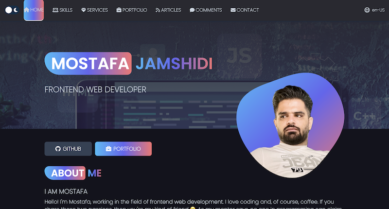
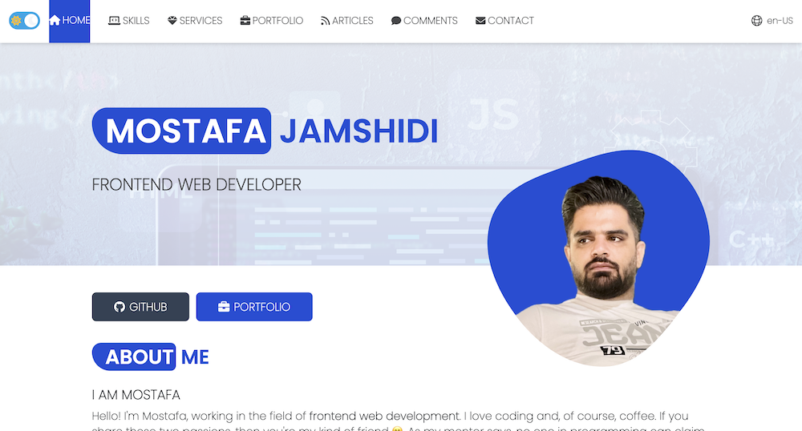
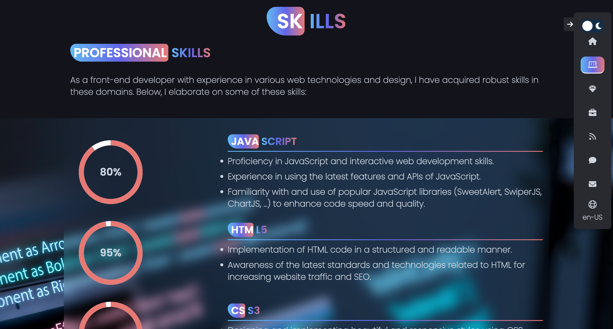
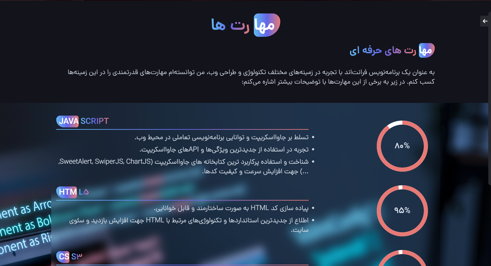
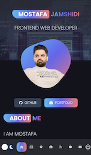
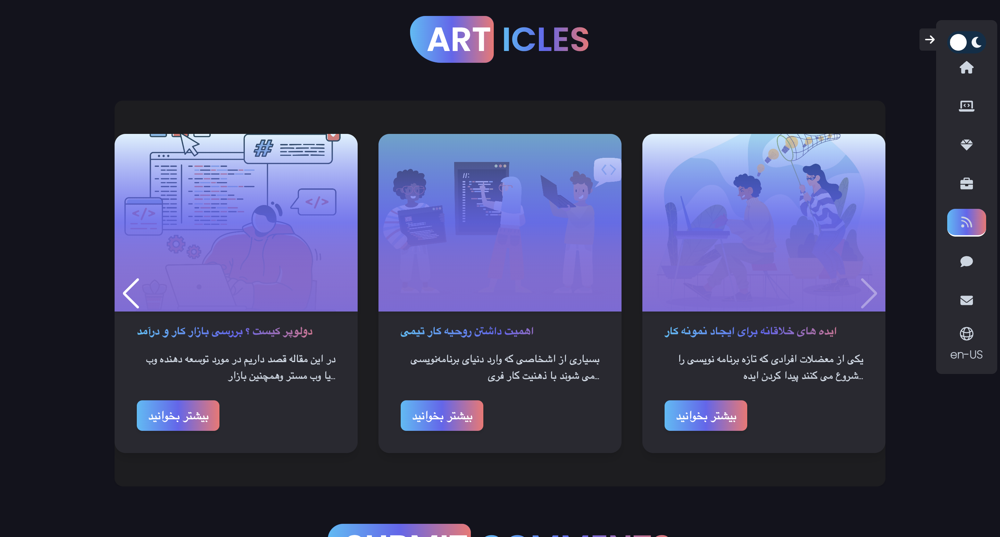
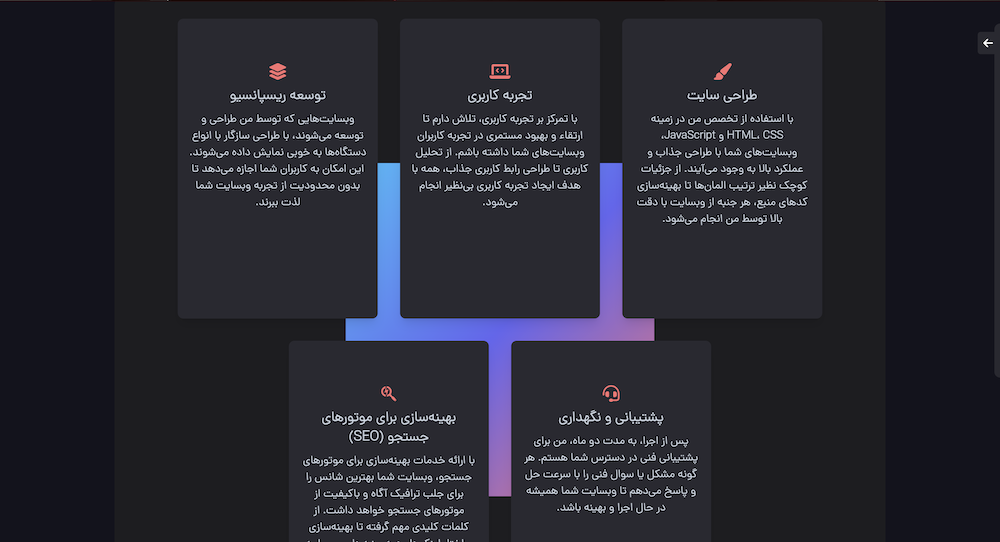
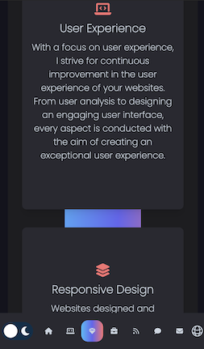

# Portfolio Responsive Complete

## [contact me in socials (link in below)]

### Portfolio Responsive Complete

### Tools & Frameworks:

  &nbsp; 
 &nbsp; 
 &nbsp; 
 &nbsp; 

 

 

### ⚡️ &nbsp; Responsive Personal Portfolio Website.
### ⚡️ &nbsp; Beautiful UI Design
### ⚡️ &nbsp; Contains animations when scrolling.
### ⚡️ &nbsp; Light and dark theme with save last theme for next reloading

### ⚡️ &nbsp; Language Changer with save last language for next reloading

 

 

### ⚡️ &nbsp; Smooth scrolling in each section.
### ⚡️ &nbsp; Developed first with the Mobile First methodology, then for desktop.

### ⚡️ &nbsp; Create many effects and features for every section
### ⚡️ &nbsp; Slider for articles

### ⚡️ &nbsp; Animation on footer section
### ⚡️ &nbsp; Three menu mode for desktop, scrolling & mobile
### ⚡️ &nbsp; Compatible with all mobile devices and with a beautiful and pleasant user interface.

💙 Follow me to see more projects like this.

     &nbsp; 
     &nbsp; 
     &nbsp; 
    

