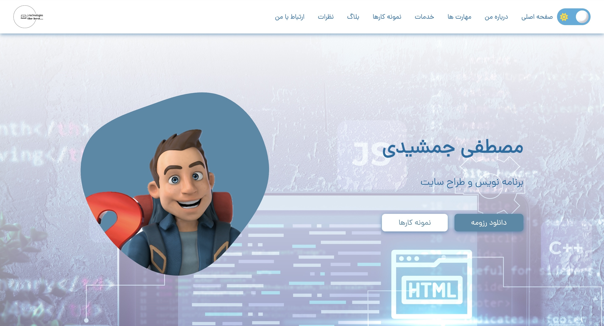

# Portfolio Responsive Complete
## [contact me in socials]
### Portfolio Responsive Complete

- Responsive Personal Portfolio Website HTML CSS & JavaScript.
- Contains animations when scrolling.
- Light and dark theme with save last theme for next reloading

- Smooth scrolling in each section.
- Developed first with the Mobile First methodology, then for desktop.

- Create many effects and features for every section
- Slider for articles

- Animation on footer section
- Burger navbar with animations on links hover
- Compatible with all mobile devices and with a beautiful and pleasant user interface.

💙 Follow me to see more projects like this.
